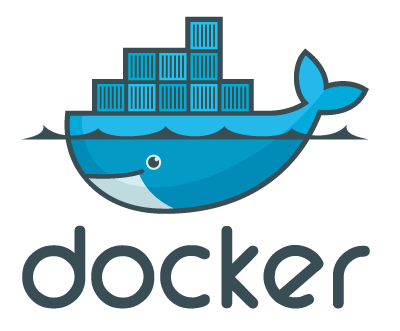

## Criar um contêiner em Docker

```Docker
`docker run --name mateus –p 6556:3306 –v dados:/var/lib/mysql –e MYSQL_ROOT_PASSWORD=mateus123 –d mysql`
```

---

Explicação de cada item para a criação de um contêiner em Docker:

- `--name` é aonde você nomeará seu contêiner na hora da criação,

- `-p` é a porta de comunicação que você utilizará para poder utilizar seu contêiner com outras ferramentas.

- `-v` é o volume, ou a pasta que será armazenada as informações e memória do Docker.

- `-e` é a senha do seu Docker que você irá definir.
  Utilizei também MYSQL_ROOT_PASSWORD= para definir a senha no MySQL

- `-d` é a imagem que você utilizará do software, especificando a versão ou apenas colocando o nome, assim fazendo o Docker entender que será a versão mais atual.

### Comandos básicos do Docker

Para ter mais informações do Docker assim que criado, utilize:

```Go
docker ps -a
```

Assim você terá mais informações do seu Docker como:
ID | Nome_Docker | Porta de Comunicação
Além de ver quantos docker você tem e as informações de cada um deles.

---

Para ativar seu Docker, apenas insira o comando:

```
docker start mateus
```

E depois disso já está ativado seu Docker, mas se quiser confirmar o Status do Docker, você pode usar o comando

```
Docker ps -a
```

## E você conseguirá visualizar se o Docker já está ativo ou não.

Para parar de rodar o Docker, utilize

```
Docker stop
```

## E assim o Docker será desligado.

E para excluir um Docker utilize o comando

```
docker rm ma
```

após o RM utilize os últimos 2 caracteres do ID do contêiner que você queira excluir.

### Outra forma de criar um docker é assim:

Primeiro você irá precisar criar um arquivo chamado:

```
docker-compose.yml
```

No caso, se for no linux, utilize o `vim` antes do `docker-compose`

Após isso, dentro do arquivo, você terá que utilizar esses comandos para criar seus dockers:

```
version: "3.1"
services:
    wordpress:
        image: wordpress
        restart: always
        ports:
            - 4863:80
        environment:
            WORDPRESS_DB_HOST: db
            WORDPRESS_FB_USER: usuario
            WORDPRESS_DB_PASSWORD: mateus@123
            WORDPRESS_DB_NAME: banco
        volumes:
         - ~/wordpress:/var/www/html
    db:
        image: mysql
        restart: always
        ports:
            - 3784:3306
        environment:
            MYSQL_DATABASE: banco
            MYSQL_USER: usuario
            MYSQL_PASSWORD: mateus@123
            MYSQL_RANDOM_ROOT_PASSWORD: '1'
        volumes:
            - ~/db:/var/lib/mysql
```

Desta forma você pode criar diversos dockers de uma vez só.

---

Para ligar o seu ou seus dockers, você pode utilizar o `docker-compose up` e seu docker irá começar a rodar, ou se precisar você pode deixar rodando em segundo plano utilizando `-d` após o `up`. Utilizar em segundo plano pode te ajudar a continuar seus trabalhos no terminal enquanto o docker continua ativo.<br>

E caso queira desligar o seu docker é só utilizar `docker-compose down` e todos os seus dockers serão desligados.

Aqui diferente da outro forma que lhe mostrei, você coloca algumas informações a mais como:<br>

```
restart: always
```

Ele serve para você permitir se o seu docker pode ou não pode ser desligado. O recomendado é deixar como always(sempre) pois deixá-lo sempre ligado pode corromper seu docker e perder dados importantes.<br>

Outra coisa diferente foi o:

```
MYSQL_RANDOM_ROOT_PASSWORD: '1'
```

Ele serve somente para o docker entender se o usuário que você está utilizando não é o usuário padrão (No caso "root").<br>

E a última informação mas não menos importante, na hora de informar a senha, usuário, banco de dados e outros, todas as letras precisam estar em maiúsculo, caso contrário, o docker não vai reconhecer as informações passadas por você.

Bom, este é meu conhecimento sobre Docker, espero que tenha ficado claro as informações e que isso possa ajudar vocês a criar seus contêiners. E caso tenham gostado desse conteúdos tem outros repositórios e projetos que eu fiz que vocês podem dar uma olhada. Enfim até mais.


